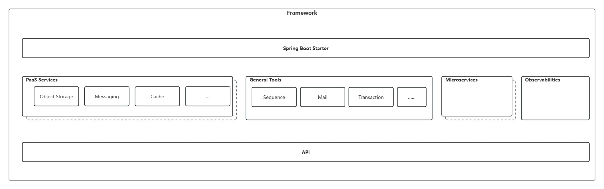
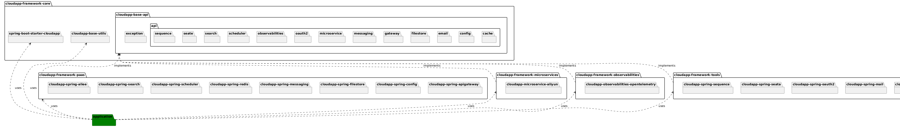

# Design and Usage Guide

#### [中文版](README-zh.md)

# Design Goals

The goal of the CloudApp framework is to design a unified  SDK  that encapsulates cloud vendor services, decoupling the programming differences among various cloud vendors' PaaS services, thereby achieving flexible delivery across different vendors with a single codebase.

From an application perspective, the current package structure includes both general  starter  dependencies and implementation dependencies corresponding to specific cloud products during the application building process, as illustrated below:

In the unified SDK implementation of the framework, there are platform services such as distributed object storage, distributed messaging, distributed caching, and distributed configuration. It also includes common services like global sequences and data sources, as well as microservice governance, observability, application server aliee, and AI platforms. In addition to unifying the SDK, the framework provides dynamic refresh and monitoring capabilities for each service. Moreover, the framework supports multiple JDK versions and Spring Boot.

Design and implementation is as follows:

[microservice](cloudapp-framework-microservices\microservice-design-and-implement.md)

[observabilities](cloudapp-framework-observabilities\observabilities-design-and-implement.md)

[gateway](cloudapp-framework-paas\cloudapp-spring-apigateway\gateway-design-and-implement.md)

[config](cloudapp-framework-paas\cloudapp-spring-config\config-design-and-implement.md)

[object storage](cloudapp-framework-paas\cloudapp-spring-filestore\object-storage-design-and-implement.md)

[messaging](cloudapp-framework-paas\cloudapp-spring-messaging\messaging-design-and-implement.md)

[cache](cloudapp-framework-paas\cloudapp-spring-redis\cache-design-and-implement.md)

[scheduler](cloudapp-framework-paas\cloudapp-spring-scheduler\scheduler-design-and-implement.md)

[search](cloudapp-framework-paas\cloudapp-spring-search\search-design-and-implement.md)

[datasource](cloudapp-framework-tools\cloudapp-datasource-druid\datasource-design-and-implement.md)

[mail](cloudapp-framework-tools\cloudapp-spring-mail\mail-design-and-implement.md)

[oauth2](cloudapp-framework-tools\cloudapp-spring-oauth2\oauth2-design-and-implement.md)

[transaction](cloudapp-framework-tools\cloudapp-spring-seata\transaction-design-and-implement.md)

[sequence](cloudapp-framework-tools\cloudapp-spring-sequence\sequence-design-and-implement.md)