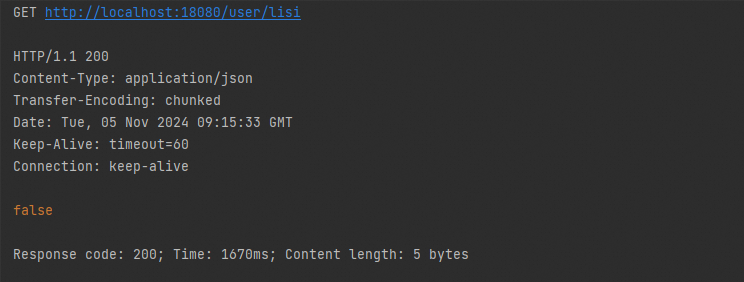
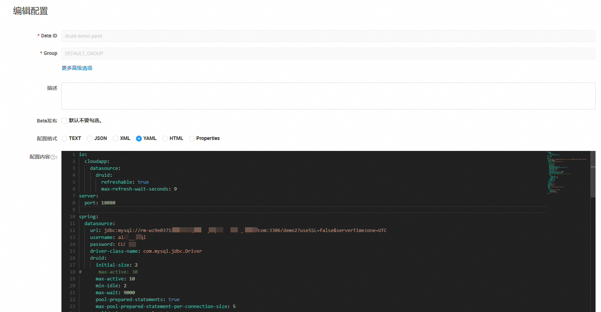
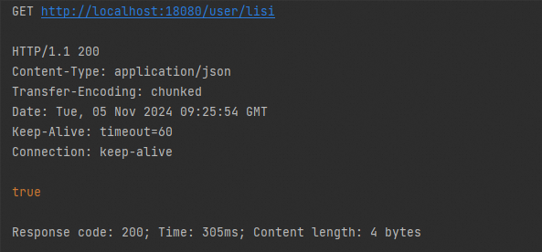

# 数据源设计与使用


# 设计说明

数据源是基于 [Apache Druid](https://druid.apache.org/) 进行设计。数据源实现继承自 DruidDataSourceWrapper，延续 `druid-spring-boot-starter` 原有能力情况下，新增数据源动态刷新能力，如通过 `spring.datasource.username` 、 `spring.datasource.password` 、 `spring.datasource.url` 、 `spring.datasource.driver-class-name` 来动态刷新数据源 Druid 属性，可用于数据库连接变化时优雅关闭连接并连接到新地址。

# 使用说明

## 配置说明

数据源实现的配置如下：

1.  定义数据源自动配置参数类 _**RefreshableDruidProperties**_ ，继承类 _**RefreshableProperties**_ ，使用注解 _**@ConfigurationProperties(prefix = RefreshableDruidProperties.BIND\_KEY)**_ ，其中 _**RefreshableDruidProperties.BIND\_KEY=io.cloudapp.datasource.druid**_ ，字段如下：
    

|  **字段名**  |  **数据类型**  |  **默认值**  |  **备注**  |
| --- | --- | --- | --- |
|  refreshEnabled  |  boolean  |  true  |  是否启用动态刷新。配置属性是否可刷新，默认无需配置  |
|  manageVersion  |  String  |  1.0  |  版本，默认无需配置  |
|  maxRefreshWaitSeconds  |  int  |  30  |  自动刷新的最大等待时间，单位秒  |


## 场景一：集成配置中心 nacos 切换数据源 mysql

### POM 配置

在依赖中引入数据源、jdbc 和 nacos 等依赖

```xml
……
<dependencyManagement>
    <dependencies>
        <dependency>
            <groupId>${groupId}</groupId>
            <artifactId>cloudapp-framework-dependencies</artifactId>
            <version>${revision}</version>
            <type>pom</type>
            <scope>import</scope>
        </dependency>
    </dependencies>
</dependencyManagement>

<dependencies>

    <dependency>
        <groupId>com.alibaba.cloud</groupId>
        <artifactId>spring-cloud-starter-alibaba-nacos-config</artifactId>
    </dependency>

    <dependency>
        <groupId>${groupId}</groupId>
        <artifactId>spring-boot-starter-cloudapp</artifactId>
    </dependency>

    <dependency>
        <groupId>${groupId}</groupId>
        <artifactId>cloudapp-datasource-druid</artifactId>
    </dependency>

    <dependency>
        <groupId>org.springframework.boot</groupId>
        <artifactId>spring-boot-starter-web</artifactId>
    </dependency>

    <dependency>
        <groupId>org.springframework.boot</groupId>
        <artifactId>spring-boot-starter-data-jpa</artifactId>
        <scope>test</scope>
    </dependency>
    
    <dependency>
        <groupId>org.springframework.boot</groupId>
        <artifactId>spring-boot-starter-jdbc</artifactId>
    </dependency>

    <dependency>
        <groupId>com.mysql</groupId>
        <artifactId>mysql-connector-j</artifactId>
    </dependency>

</dependencies>
……
```

### 应用配置

在应用配置文件中配置的数据源连接地址为本地开发使用的 mysql 如下

```yaml
io:
  cloudapp:
    datasource:
      druid:
        refreshable: true
        max-refresh-wait-seconds: 10

server:
  port: 18080

spring:
  datasource:
    url: jdbc:mysql://localhost:3306/demo2?useSSL=false&serverTimezone=UTC;
    username: root
    password: toor
    driver-class-name: com.mysql.jdbc.Driver
    druid:
      initial-size: 2
      max-active: 30
      min-idle: 2
      max-wait: 1000
      pool-prepared-statements: true
      max-pool-prepared-statement-per-connection-size: 5
      validation-query: select 1
      validation-query-timeout: 1
      test-on-borrow: true
      test-on-return: true
      test-while-idle: true
      time-between-eviction-runs-millis: 10000
      min-evictable-idle-time-millis: 30001
      async-close-connection-enable: true
      aop-patterns: com.alibaba.druid.spring.boot.demo.service.*
      filter:
        stat:
          db-type: mysql
          log-slow-sql: true
          slow-sql-millis: 2000
          enabled: true
      stat-view-servlet:
        enabled: true
      web-stat-filter:
        enabled: true
  jpa:
    show-sql: true
    hibernate:
      ddl-auto: update
  application:
    name: druid-demo
  config:
    import: nacos:druid-demo.yaml?refresh=true
  cloud:
    nacos:
      config:
        server-addr: 127.0.0.1:8848
        username: nacos
        password: nacos
        group: DEFAULT_GROUP
```

### 使用验证

在应用配置中添加数据源、nacos 等配置；

```java
@RestController
public class RefreshableDruidDataSourceController {
    
    private static final Logger logger =
            LoggerFactory.getLogger(RefreshableDruidDataSourceController.class);
    
    @Resource
    private RefreshableDruidDataSourceWrapper refreshableDataSource;
    
    @RequestMapping("/freshDruid")
    public void testDataSourcePropertiesOverridden() throws Exception {
        long maxWait = refreshableDataSource.getMaxWait();
        logger.info("maxWait is : {} .", maxWait);
        
        long maxRefreshWaitMillis = refreshableDataSource.getMaxRefreshWaitMillis();
        logger.info("maxRefreshWaitMillis is : {} .", maxRefreshWaitMillis);
        
    }
    
    @RequestMapping("/user/{username}")
    public boolean getUser(@PathVariable String username) {
        DruidPooledConnection connection = null;
        try {
            connection = refreshableDataSource.getConnection();
            String sql = "SELECT * FROM user WHERE username = '" + username + "'";
            PreparedStatement ps = connection.prepareStatement(sql);
            ResultSet rs = ps.executeQuery();
            if (rs.next()) {
                logger.info("user {} exist.", username);
                return true;
            } else {
                logger.info("user {} not exist.", username);
                return false;
            }
        } catch (SQLException e) {
            logger.error("error", e);
        }
    
        return false;
    }
    
}
```

1.  首先，在应用配置文件中配置本地开发 mysql ，调用用户查询接口，返回 false 表明本地库不存在用户 lisi；
    



2.  然后，在 nacos 中添加应用的配置文件，把数据源地址改为生产 mysql 如下：
    



3.  最后，调用用户查询接口，返回 true 表明生产库存在用户 lisi，切换数据源成功；
    


